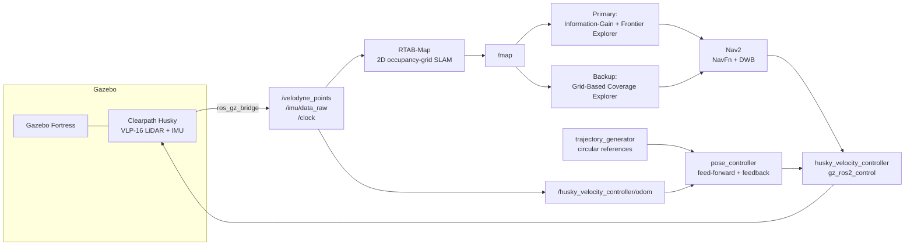

# Husky Field Exploration

ROS 2 package for a simulated Clearpath Husky implementing a complete sense–plan–act pipeline: reference-tracking control, autonomous navigation (SLAM + Nav2), and autonomous exploration of unknown environments in Gazebo Fortress.

The repository contains two exploration strategies:

1. **Primary — information-gain + frontier exploration** (`frontier_explorer.py`)
2. **Backup — grid-based coverage exploration** (`coverage_explorer.py`)

The information-gain frontier explorer is the method used for the final Task 3 exploration deployment. The coverage explorer was separately implemented and **attempted as a backup/fallback strategy**. It does not use frontier detection or information-gain scoring; instead it targets currently known, unvisited free-space regions.

## Assignment tasks

| Task | Requirement | Implementation |
|---|---|---|
| 1 | Control system accepting position and heading references; pose-to-pose and circular-trajectory tracking | `fieldrobo/pose_controller.py`, `fieldrobo/trajectory_generator.py`, `launch/task1_sim.launch.py` |
| 2 | Navigation stack with technical description of each sub-component | `config/nav2params.yaml`, `config/rtabmap_params.yaml`, `launch/task2_nav.launch.py` |
| 3 | Autonomous exploration of an unknown environment | Primary: `fieldrobo/frontier_explorer.py`; Backup: `fieldrobo/coverage_explorer.py` |

## System overview



## Platform and sensing

A Clearpath Husky is simulated in Gazebo Fortress using a Velodyne VLP-16 GPU LiDAR and IMU.

- LiDAR: approximately 10 Hz point cloud on `/velodyne_points`
- IMU: approximately 50 Hz
- ROS 2 bridge: `ros_gz_bridge`
- Controller interface: `gz_ros2_control`
- Velocity command: `/husky_velocity_controller/cmd_vel_unstamped`
- Odometry: `/husky_velocity_controller/odom`

RTAB-Map consumes the LiDAR point cloud and wheel odometry and produces a continuously updated 2D occupancy grid.

## Task 1 — Control system

`fieldrobo/pose_controller.py` implements a single controller for both stationary and moving references.

### Pose-to-pose control

For stationary references, the controller uses a polar pose-regulation law to drive the robot to the target position and then align the final heading.

### Circular trajectory tracking

`fieldrobo/trajectory_generator.py` publishes a time-parametrized circular `PoseStamped` reference stream on `/reference_pose`.

The controller uses feed-forward plus feedback for moving references, with reference linear and angular velocities estimated from consecutive pose references.

Commands are saturated by configurable linear and angular velocity limits and the controller runs at 50 Hz.

## Task 2 — Navigation stack

`launch/task2_nav.launch.py` starts the navigation stack:

- **SLAM — RTAB-Map:** LiDAR + wheel odometry, 2D occupancy-grid mapping, ICP registration and loop closure.
- **Global planner — Nav2 NavFn:** computes a global route through the costmap.
- **Local controller — Nav2 DWB:** tracks the global plan while respecting velocity limits.
- **Velocity smoother:** refines velocity commands.
- **Recovery behaviors:** spin, backup and wait behaviors are available for navigation failures.
- **Costmaps:** global and local costmaps use obstacle/voxel information and inflation.
- **Gazebo/ROS bridge:** transports simulated sensor and timing information into ROS 2.

## Task 3 — Primary autonomous exploration

The final Task 3 deployment uses:

```text
fieldrobo/frontier_explorer.py
```

and is launched with:

```bash
ros2 launch fieldrobo task3_explorer.launch.py
```

The primary exploration loop is:

1. **Frontier detection** — free cells adjacent to unknown cells are identified and clustered.
2. **Candidate generation** — multiple candidate viewpoints are generated around each frontier and offset into known free space.
3. **Safety filtering** — candidates are checked for local clearance.
4. **Nav2 feasibility filtering** — `ComputePathToPose` is used to reject candidates that cannot be planned to safely.
5. **Information-gain scoring** — candidates are ranked using expected newly sensed area versus travel distance.
6. **Goal execution** — the selected viewpoint is sent to Nav2 using `NavigateToPose`.
7. **Recovery/watchdog** — failed or timed-out goals are handled using the explorer's blacklist and watchdog logic.
8. The cycle repeats as the occupancy grid changes and new frontiers appear.

The primary method therefore combines **frontier-based exploration** with an **information-gain utility**, rather than simply selecting the nearest frontier.

## Backup — Grid-based coverage explorer

A separate backup strategy was implemented in:

```text
fieldrobo/coverage_explorer.py
```

and exposed as the ROS 2 executable:

```bash
ros2 run fieldrobo coverage_explorer
```

It is intended to run with the same mapping and Nav2 infrastructure after the navigation stack is available.

### Why it was implemented

The coverage explorer was developed as a fallback in case the information-gain/frontier decision layer encountered problems during integration. It provides a substantially simpler exploration policy and avoids depending on frontier extraction or information-gain computation.

> **The information-gain + frontier explorer is the primary/final Task 3 method. The coverage explorer is an attempted backup/fallback implementation.**

### How the backup method works

The coverage explorer explicitly does **not** use frontier detection or information-gain scoring.

Instead it:

1. Receives the current `/map` occupancy grid.
2. Tracks the cells of known free space that have been visited by the robot.
3. Groups remaining known-free, unvisited cells into coarse spatial regions.
4. Generates safe candidate goal cells inside those regions.
5. Ranks candidate regions primarily by their distance from the robot.
6. Checks candidate paths using Nav2's `ComputePathToPose`.
7. Sends a reachable candidate to Nav2 with `NavigateToPose`.
8. Marks successfully reached areas as visited.
9. Blacklists failed goal regions and continues with another candidate.
10. Reports a coverage diagnostic based on visited free cells versus currently known free cells.

The default implementation parameters include:

```text
cell_size              = 1.0 m
visit_radius           = 1.0 m
min_unvisited_region   = 8 cells
candidate_count        = 8
candidate_radius       = 0.7 m
goal_obstacle_radius   = 0.45 m
min_goal_separation    = 0.8 m
failed_region_radius   = 1.5 m
goal_timeout           = 60 s
planner_check_timeout  = 5 s
planning_period        = 2 s
```

This strategy is deliberately simpler than the primary information-gain explorer. It is useful as a fallback and can also serve as a future heuristic baseline for quantitative experiments.

## Comparison of the two exploration strategies

| Aspect | Primary: Information-gain + frontier | Backup: Grid-based coverage |
|---|---|---|
| Frontier detection | Yes | No |
| Information-gain scoring | Yes | No |
| Unknown-space reasoning | Directly through frontier/information gain | Indirectly; unknown cells become eligible only after mapping reveals free space |
| Candidate basis | Frontier viewpoints | Unvisited known-free regions |
| Candidate ranking | Information gain versus travel distance | Region/candidate distance |
| Nav2 path feasibility | Yes | Yes |
| Visited-space tracking | Goal history / blacklists | Explicit visited-cell set |
| Coverage diagnostic | Not the main decision criterion | Explicit known-free vs visited-free percentage |
| Role in final Task 3 | **Primary method** | **Backup/fallback implementation** |

## Requirements

- Ubuntu 22.04
- ROS 2 Humble
- Gazebo Fortress
- `colcon`

### Dependencies

```bash
sudo apt install ros-humble-navigation2 ros-humble-nav2-bringup                  ros-humble-rtabmap-ros                  ros-humble-ros-gz                  ros-humble-gz-ros2-control                  ros-humble-controller-manager                  ros-humble-joint-state-broadcaster                  ros-humble-joint-trajectory-controller
```

## Build

```bash
cd ~/phd_ws
colcon build --packages-select fieldrobo
source install/setup.bash
```

## Usage

### Task 1

```bash
ros2 launch fieldrobo task1_sim.launch.py
ros2 run fieldrobo pose_control
```

For circular trajectory tracking:

```bash
ros2 run fieldrobo traj_generate
```

### Task 2

```bash
ros2 launch fieldrobo task2_nav.launch.py
```

### Task 3 — Primary exploration

```bash
ros2 launch fieldrobo task3_explorer.launch.py
```

### Backup coverage exploration

After the mapping and Nav2 stack are running:

```bash
ros2 run fieldrobo coverage_explorer
```

Do not run both exploration nodes simultaneously because both can send goals to the same Nav2 `NavigateToPose` action.

## Repository structure

```text
husky-field-exploration/
├── config/
├── fieldrobo/
│   ├── pose_controller.py
│   ├── trajectory_generator.py
│   ├── frontier_explorer.py
│   └── coverage_explorer.py
├── launch/
├── meshes/
├── urdf/
├── world/
├── videos/
├── test/
├── setup.py
├── package.xml
└── README.md
```

## Exploration design

The exploration layer is intentionally separated from the rest of the autonomy stack:

```text
                         /map
                           |
             +-------------+-------------+
             |                           |
             v                           v
  Information-Gain +             Grid-Based Coverage
  Frontier Explorer               Explorer (backup)
             |                           |
             +-------------+-------------+
                           |
                           v
                    Nav2 NavigateToPose
                           |
                           v
                    Husky / cmd_vel
```

This makes it possible to investigate different exploration policies while keeping RTAB-Map, Nav2 planning/control, costmaps and the Husky velocity interface unchanged.

## Future research direction

Potential extensions include:

- Occlusion-aware information gain using sensor-model ray casting.
- Normalized multi-objective utility combining information gain, travel cost and clearance.
- Receding-horizon viewpoint sequencing instead of one-step greedy selection.
- Faster/vectorized frontier extraction and candidate evaluation.
- Wheel + IMU state-estimation fusion.
- Skid-steer-aware motion modelling.
- Quantitative benchmarking using coverage-over-time, path length, decision latency, planner failures and localization error.
- Comparison of the primary information-gain explorer against simpler frontier and coverage baselines.

## Demonstration videos

The repository contains demonstration videos for the assignment tasks.

### Task 1 — Controller evaluation

- Pose-to-pose navigation.
- Circular trajectory generation.
- Closed-loop trajectory tracking.

### Task 2 — Navigation and exploration stack

- VLP-16 LiDAR perception.
- RTAB-Map mapping.
- Nav2 global and local planning.
- Information-gain/frontier-based exploration.
- Autonomous navigation to selected exploration goals.

### Task 3 — Autonomous exploration

The final demonstration uses the **primary information-gain + frontier explorer**, showing:

- Autonomous frontier selection.
- Nav2 path planning and execution.
- Incremental occupancy-map construction.
- Autonomous Husky movement through the unknown environment.
- Final explored map.

The backup coverage explorer is included as an alternative/fallback implementation rather than the primary Task 3 demonstration method.

## AI tool usage

An LLM-based AI assistant (Sarvam AI) was used for repository/code analysis, report structuring and drafting assistance. Technical claims were checked against the implementation and configuration files; the experimental interpretation, prioritization and final research direction were decided and edited by the author.

## License

Apache-2.0 — see `LICENSE`.